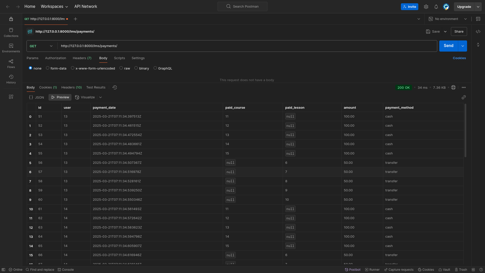

### Для модели курса добавлено в сериализатор поле вывода количества уроков. 

Поле реализовал с помощью 
## SerializerMethodField()
___

 Добавил новую модель в приложение users:  Платежи  

пользователь,  
дата оплаты,  
оплаченный курс или урок,  
сумма оплаты,  
способ оплаты: наличные или перевод на счет.  
Поля   
пользователь   
оплаченный курс и   
отдельно оплаченный урок  
___
# Реализована вложенность в сериализаторе курсов
# Настроил фильтрацию для эндпоинта вывода списка платежей с возможностями:

1. # менять порядок сортировки по дате оплаты,

2. # фильтровать по курсу или уроку,

3. # фильтровать по способу оплаты.

---
