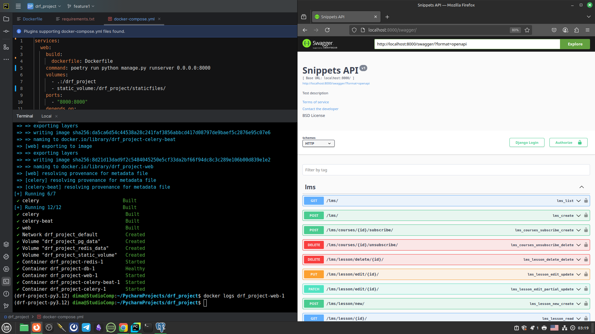

# Тема 34.2 Docker Compose
## Домашняя работа к модулю 9
___
## Запуск Docker Compose локально 
```docker compose up -d --build``` 
Обязательно учитывайте что весь проект в т.ч.  docker работают в окружении Poetry !!!
 ## Результат работы:


---
 ## Структура контейнеров.
 
 ✔ web <br>
 ✔ db <br>
 ✔ redis <br>
 ✔ celery <br>
 ✔ celery-beat <br>

         
# В проекте :
1. Создан новый Django-проект, подключен DRF в настройках проекта.
2. Созданы следующие модели:
Пользователь: все поля от обычного пользователя, но авторизацию заменить на email; телефон; город; аватарка. <br> Модель пользователя разместите в приложении users

•Курс:
название, превью (картинка), описание.

•Урок:
название, описание, превью (картинка), ссылка на видео.

3. Описан CRUD для моделей курса и урока. Для реализации CRUD для курса использован Viewsets, а для урока - Generic-классы.
4. Для модели курса добавлен в сериализатор поле вывода количества уроков.
5. Описана новая модель для платежей в приложении "users"
6. Добавлена фильтрация для списка платежей
7. Реализован CRUD для пользователей, регистрация и JWT-авторизация.
8. Создана группа модераторов с правами только на просмотр и изменение. Добавлен функционал проверки в контроллеры.
9. Описаны права доступа для объектов. Если пользователь не входит в группу модераторов может видеть, редактировать и удалять только свои уроки и курсы.
10. Реализованна дополнительная валидация ссылки на видео (разрешен толь доступ к youtube.com)
11. Добавлена модель подписки на обновления курса для пользователя.
12. Реализована пагинация для вывода всех уроков и курсов.
13. Описаны тесты, которые будут проверять корректность работы CRUD уроков и функционал работы подписки на обновления курса.
14. Подключена и произведена настройка вывода документации drf-yasg
15. Подключена возможность оплаты курсов через сервис stripe
16. Проект настроен для работы с Celery и Celery-beat
17. Добавлена асинхронная задача рассылки писем об обновлении курса на который они подписаны
18. Реализована фоновая задача которая деактивирует пользователя если он не неактивен в течении 30 дней
